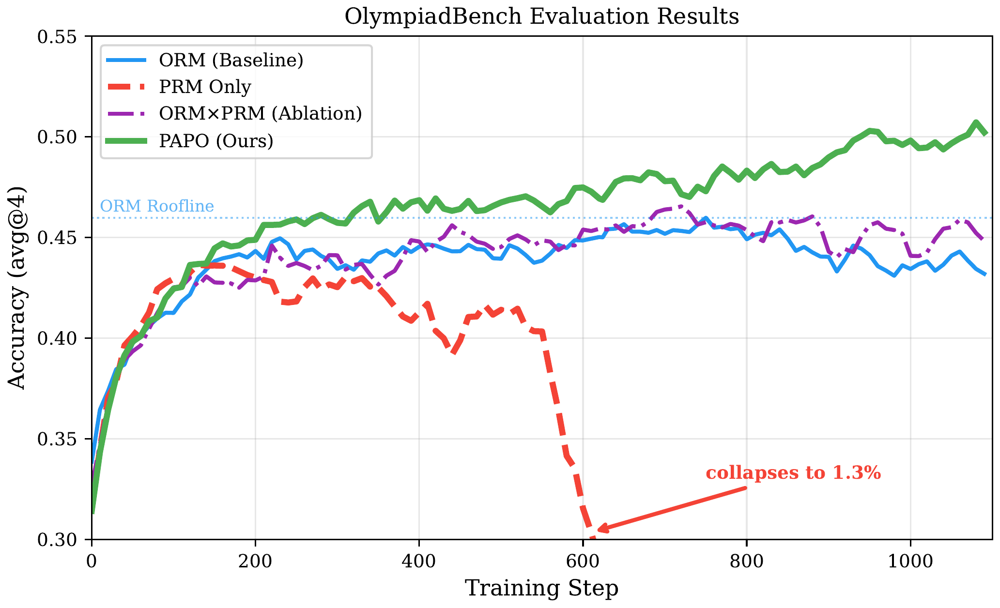
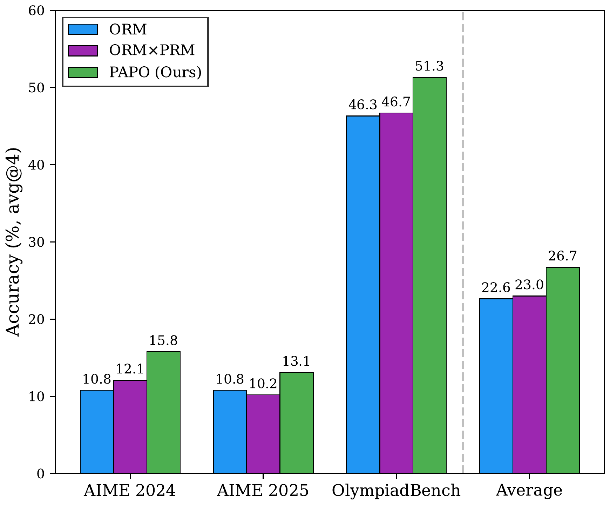
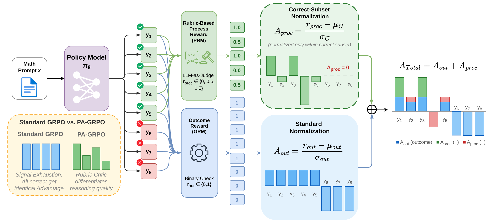

# PAPO: Process-Aware Policy Optimization

[](https://arxiv.org/abs/2603.26535)
[](https://huggingface.co/datasets/Artemis0430/NuminaMath-20k-Stratified)
[](LICENSE)

Official implementation of **"Stabilizing Rubric Integration Training via Decoupled Advantage Normalization"**.

PAPO integrates process-level evaluation into GRPO through **decoupled advantage normalization**. ORM treats all correct answers identically (signal exhaustion), while directly using PRM causes reward hacking. PAPO decomposes the advantage into two independently normalized components — outcome (A_out) over all responses and process (A_proc) over correct responses only — so that correctness anchors training while reasoning quality provides a sustained learning signal.

## Key Results

<table>
<tr>
<td width="58%"></td>
<td width="42%"></td>
</tr>
<tr>
<td colspan="2" align="center"><em>Figure 1: (a) OlympiadBench training curves. (b) Accuracy on competition math benchmarks.</em></td>
</tr>
</table>

**Figure 1(a)**: ORM peaks at 46.3% then declines (signal exhaustion). PRM Only collapses to 1.3% (reward hacking). ORM x PRM tracks ORM but cannot surpass it. **PAPO reaches 51.3% and continues improving**, demonstrating that decoupled normalization successfully integrates process evaluation without instability.

**Figure 1(b)**: PAPO's gains generalize across AIME 2024, AIME 2025, and OlympiadBench, with the largest improvements on harder benchmarks.

<p align="center">
  
  <br>
  <em>Figure 2: Overview of PAPO.</em>
</p>

## Quick Start

**Requirements:** Python 3.12, 8x GPUs (H100/H200), CUDA 12.x

```bash
# Install (verl backend)
conda create -n papo python=3.12 -y && conda activate papo
pip install vllm==0.14.0 && pip install flash-attn --no-build-isolation
cd verl && pip install -e . && cd .. && pip install -r requirements.txt

# Launch LLM grader (2 GPUs, separate from training)
CUDA_VISIBLE_DEVICES=0,1 vllm serve openai/gpt-oss-20b \
  --tensor-parallel-size 2 --port 8000 --max-model-len 8192 --gpu-memory-utilization 0.85

# Train PAPO
cd verl && bash scripts/run_grpo_qwen2.5_7b_base_megatron_8gpu_dual_lambda1.sh

# Train ORM baseline
bash scripts/run_grpo_qwen2.5_7b_base_megatron_8gpu_baseline.sh
```

Training scripts for other models (Qwen2.5-3B/14B, Qwen3-4B-Base) and ablations (PRM-only, full normalization, multiplicative) are in `verl/scripts/`. PAPO is also implemented on [ROLL](https://github.com/alibaba/ROLL) — see [`roll/README.md`](roll/README.md).

## Method

```python
# Per group of G responses to the same prompt:
A_out  = normalize(ORM_scores)                    # standard GRPO over all responses
A_proc = normalize(PRM_scores, mask=correct_only) # among correct responses only
A_total = A_out + A_proc
```

- **Correct-subset normalization** prevents wrong answers from exploiting high PRM scores
- **Decoupled signals** let A_proc sustain learning even when all responses are correct (A_out = 0)

## Citation

```bibtex
@misc{tan2026stabilizingrubricintegrationtraining,
      title={Stabilizing Rubric Integration Training via Decoupled Advantage Normalization}, 
      author={Zelin Tan and Zhouliang Yu and Bohan Lin and Zijie Geng and Hejia Geng and Yudong Zhang and Mulei Zhang and Yang Chen and Shuyue Hu and Zhenfei Yin and Chen Zhang and Lei Bai},
      year={2026},
      eprint={2603.26535},
      archivePrefix={arXiv},
      primaryClass={cs.AI},
      url={https://arxiv.org/abs/2603.26535}, 
}
```

## License

Apache 2.0. Built on [verl](https://github.com/volcengine/verl) and [ROLL](https://github.com/alibaba/ROLL).

## Acknowledgements

[verl](https://github.com/volcengine/verl) | [ROLL](https://github.com/alibaba/ROLL) | [GPT-OSS-20B](https://huggingface.co/openai/gpt-oss-20b) | [Qwen](https://github.com/QwenLM/Qwen2.5)
